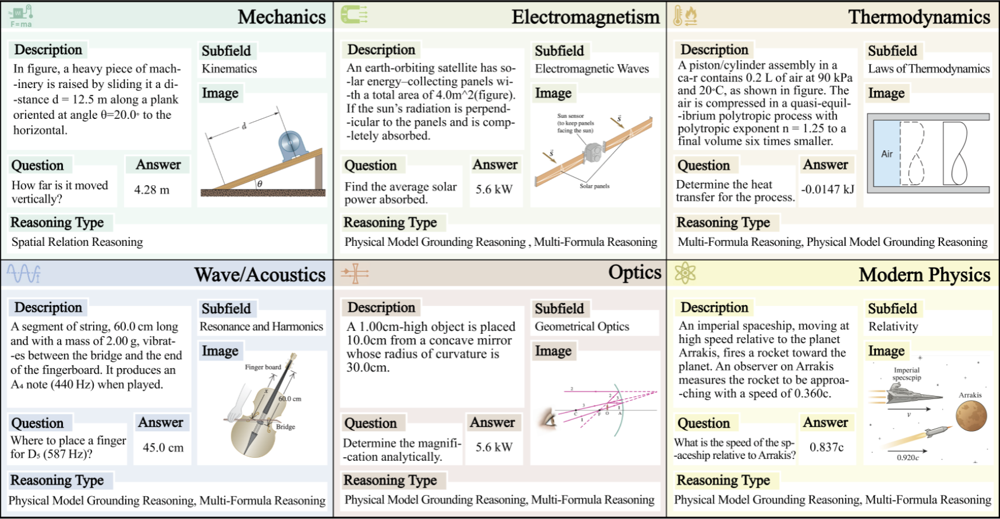

# PhyX: Does Your Model Have the "Wits" for Physical Reasoning?

<h5 align="center"> If you like our project, please give us a star ⭐ on GitHub for the latest update.</h5>


Code for the paper "[PhyX: Does Your Model Have the &#34;Wits&#34; for Physical Reasoning?](https://huggingface.co/datasets/Cloudriver/PhyX)".

For more details, please refer to the project page with **dataset exploration and visualization tools**: [https://phyx-bench.github.io/](https://phyx-bench.github.io/).

[[🌐 Project Page](https://phyx-bench.github.io/)] [[📖 Paper](https://arxiv.org/abs/2505.15929)] [[🤗 Huggingface Dataset](https://huggingface.co/datasets/Cloudriver/PhyX)]  [[🌐 Blog (中文)](https://mp.weixin.qq.com/s/okKn6WrWilPmo0_yOcDP3Q)]

<p align="center">
     <br>
</p>

## 📖 Outlines

- [PhyX: Does Your Model Have the "Wits" for Physical Reasoning?](#phyx-does-your-model-have-the-wits-for-physical-reasoning)
  - [📖 Outlines](#-outlines)
  - [🔔 News](#-news)
  - [📝 About PhyX](#-about-phyx)
  - [🔮 Usage](#-usage)
    - [📦 Dataset Versions](#-dataset-versions)
    - [Sample Format and Field Definitions](#sample-format-and-field-definitions)
    - [🔨 Evaluation on PhyX](#-evaluation-on-phyx)
      - [VLMEvalKit (Official)](#vlmevalkit-official)
      - [Code in this repository](#code-in-this-repository)
  - [✅ Cite](#-cite)
  - [❤️ Contributors](#️-contributors)

## 🔔 News

- **[2025.07.21]** 🎉 PhyX is officially supported by [lmms-eval](https://github.com/EvolvingLMMs-Lab/lmms-eval) for easy evalution.
- **[2025.05.27]** 🎉 PhyX is officially supported by [VLMEvalKit](https://github.com/open-compass/VLMEvalKit) for easy evalution.
- **[2025.05.23]** 🚀 The [arXiv paper](https://arxiv.org/abs/2505.15929) is online!
- **[2025.05.21]** 🚀 We release the testmini set of PhyX at [Huggingface](https://huggingface.co/datasets/Cloudriver/PhyX) and the [evaluation code](https://github.com/NastyMarcus/PhyX)!

## 📝 About PhyX

PhyX is the first large-scale benchmark specifically designed to assess models' ability in physical reasoning through realistic, visually grounded scenarios.

PhyX includes 3,000 meticulously collected multimodal questions, covering 6 reasoning types across 25 sub-domains and 6 core domains: thermodynamics, electromagnetism, mechanics, modern physics, optics, and wave acoustics.


PhyX specializes in university-level challenging questions presented through realistic, high-fidelity visual scenarios. Unlike general-purpose benchmarks, our tasks require models to integrate visual cues with implicit physical laws, going beyond simple knowledge recall and demanding nuanced, context-driven inference. This design enables a rigorous evaluation of true multimodal reasoning about the physical world, exposing key limitations in current models’ capabilities when handling professional-level scientific problems.


PhyX consists of 3,000 visually grounded physics questions, carefully curated across six distinct physics domains:

- Mechanics (550)
- Electromagnetism (550)
- Thermodynamics (500)
- Wave/Acoustics (500)
- Optics (500)
- Modern Physics (400)

Data examples:



## 🔮 Usage

### 📦 Dataset Versions

PhyX contains two subsets: `testmini` (1,000 questions) and `test` (3,000 questions). Each subset includes 12 versions tailored for different evaluation settings:

| File Name                  | Type & Input Style                                                         | Description                                                   |
| -------------------------- | -------------------------------------------------------------------------- | ------------------------------------------------------------- |
| `PhyX_mini_OE.tsv`       | OE / Text-DeRedundancy (Image + Simplified Description + Question)         | OE version with simplified description                        |
| `PhyX_mini_MC.tsv`       | MC / Text-DeRedundancy (Image + Simplified Description + Question)         | MC version with simplified description                        |
| `PhyX_mini_OE_FT.tsv`    | OE / Full-Text (Image + Full Description + Question)                       | Open-ended questions with full original description and image |
| `PhyX_mini_MC_FT.tsv`    | MC / Full-Text (Image + Full Description + Question)                       | Multiple-choice version with original description and image   |
| `PhyX_mini_OE_TM.tsv`    | OE / Text-Minimal (Image + Question)                                       | OE version with image only (description removed)              |
| `PhyX_mini_MC_TM.tsv`    | MC / Text-Minimal (Image + Question)                                       | MC version with image only                                    |
| `PhyX_mini_TL_OE.tsv`    | OE / Text-DeRedundancy (Image Caption + Simplified Description + Question) | OE version with image caption and simplified description      |
| `PhyX_mini_TL_MC.tsv`    | MC / Text-DeRedundancy (Image Caption + Simplified Description + Question) | MC version with image caption and simplified description      |
| `PhyX_mini_TL_OE_FT.tsv` | OE / Full-Text (Image Caption + Full Description + Question)               | OE version with image converted to text (`image_caption`)   |
| `PhyX_mini_TL_MC_FT.tsv` | MC / Full-Text (Image Caption + Full Description + Question)               | MC version with image converted to text                       |
| `PhyX_mini_TL_OE_TM.tsv` | OE / Text-Minimal (Image Caption + Question)                               | OE version with image caption only (no description)           |
| `PhyX_mini_TL_MC_TM.tsv` | MC / Text-Minimal (Image Caption + Question)                               | MC version with image caption only (no description)           |
| **Default Setting**  | ✅ Text-DeRedundancy (MC & OE)                                             | `PhyX_mini_OE.tsv` and `PhyX_mini_MC.tsv` are default.    |

- 🔍 mini stands for the 1,000-questions testmini set.
- MC: multiple-choice
- OE: open-ended (OE)
- TL: text-only (image converted to image_caption)
- FT: full-text (image + full description + Question)
- TM: description removed (image + question, without description)

### Sample Format and Field Definitions

📘 Each entry in PhyX is stored as a JSON object with the following fields:

| Field                    | Type   | Description                                                                  |
| ------------------------ | ------ | ---------------------------------------------------------------------------- |
| `index`                | int    | Index of the question                                                        |
| `question`             | string | Question                                                                     |
| `question_description` | string | Original full description of the problem                                     |
| `question_simply`      | string | Simplified version of the question description (used in `SIMPLY` versions) |
| `options`              | string | Answer options, format:`A:"...", B:"...", ...`                             |
| `answer`               | string | Ground truth answer                                                          |
| `image`                | string | Image filename (e.g.,`200.png`)                                            |
| `image_caption`        | string | Textual description of the image (only in `TL` versions)                   |
| `category`             | string | Physics category (e.g.,`"Optics"`)                                         |
| `subfield`             | string | Fine-grained physics subfield (e.g.,`"Geometrical Optics"`)                |
| `reasoning_type`       | string | Type(s) of Physical Reasoning                                                |

You can use this format to load and evaluate different question versions based on your model’s capability (e.g., multimodal, text-only).

### 🔨 Evaluation on PhyX

#### VLMEvalKit (Official)

PhyX is officially supported by [VLMEvalKit](https://github.com/open-compass/VLMEvalKit).
You can use the official code at https://github.com/open-compass/VLMEvalKit.
Please follow the official guidance to create a pip/conda environment.

For a quick start, just use:

```
#*********judge based on rules*********
python -u run.py --data PhyX_mini_MC \
  --model GPT4o_20241120 \
  --judge-args '{"valid_type": "STR"}'


#*********deepseek v3 from siliconflow as judger*********
python -u run.py --data PhyX_mini_MC \
  --model GPT4o_20241120 \
  --judge deepseek --judge-args '{"valid_type": "LLM"}'
```

#### llms-eval (Official)

PhyX is officially supported by [llms-eval](https://github.com/EvolvingLMMs-Lab/lmms-eval).
You can use the official code at https://github.com/EvolvingLMMs-Lab/lmms-eval.
Please follow the official guidance to create a pip/conda environment.

For a quick start, just use:

```
#*********judge based on rules*********
python3 -m lmms_eval \
    --model openai_compatible \
    --model_args model_version=gpt-4o-2024-11-20,azure_openai=False \
    --tasks phyx_mini_mc \
    --batch_size 1 \
    --output_path $Your_PATH
```

The `Task` can be one of `phyx_mc`, `phyx_oe`, `phyx_mini_mc`, and `phyx_mini_oe`.
`mc` denotes multiple-choice, `oe` for open-ended question. There are 3000 samples, while `mini` is for the mini version with 1000 samples.

After inference, you can set `quick_extract` to be false or true. True denotes judging by rules, while False denotes llm-as-judge. Default value is False. We are using official Deepseek-V3 as the default judger. Please remember to set env variable `Deepseek_API`.


#### Code in this repository

Also, in this repository, we implement more evaluation settings. The evaluation codes are based on [VLMEvalKit](https://github.com/open-compass/VLMEvalKit), and we thank the authors for their efforts.
Please follow the [readme](README_vlmeval.md) to create a pip/conda environment.

We use DeepSeek-V3 as the LLM-based judger, and we add support for the official API.
Please set the `SiliconFlow_API_KEY` or `Deepseek_API` to use it.
The former one would employ the DeepSeek-V3 provided by SiliconFlow, and the latter one would be for official servers.

Alternatively, you can perform rule-based judgment, which is **free**.
We carefully design rules to extract the answer from outputs and then compare it with the ground truth.

➡️ VLM

To evaluate a VLM on PhyX, please refer to the examples in `examples/VLM/`, such as:

```
export LMUData=dataset  # using local dataset file folder

#*********judge based on rules*********
python -u run.py --data PhyX_mini_OE \
    --model GPT4o_20241120 \
    --judge-args '{"valid_type": "STR"}'


#*********deepseek v3 from siliconflow as judger*********
## export SiliconFlow_API_KEY=

# valid_type: STR or LLM
python -u run.py --data PhyX_mini_OE \
    --model GPT4o_20241120 \
    --judge deepseek-v3-si --judge-args '{"valid_type": "LLM"}'


#*********official deepseek v3 as judger*********

# export Deepseek_API=

python -u run.py --data PhyX_mini_OE \
    --model GPT4o_20241120 \
    --judge deepseek-v3 --judge-args '{"valid_type": "LLM"}'

```

This example shows how to evaluate `GPT4o_20241120` using DeepSeek-V3 as the judge.

Details for these parameters:

- `--data`: The dataset configuration to evaluate, e.g., `PhyX_mini_MC` for multiple-choice or  `PhyX_mini_OE` for open-ended.
- `--model`: The model to be evaluated. Please refer to [this link](https://aicarrier.feishu.cn/wiki/Qp7wwSzQ9iK1Y6kNUJVcr6zTnPe?table=tblsdEpLieDoCxtb) for supported models.
- `--valid_type`: Judgment method — `LLM` for LLM-based evaluation or `STR` for rule-based matching.
- `--judge`: judger,  `deepseek-v3-si` for deepseek-v3 provided by SiliconFlow (set SiliconFlow_API_KEY) and `deepseek-v3` for official (set Deepseek_API).

➡️ LLM

In this repository, we support more LLMs for evaluation.
If you want to evaluate on LLM (i.e., in text only setting), please refer to examples in `examples/LLM_textonly/`, where we add an extra environment variable `PHYX_TEXT_ONLY=true`.

➡️ Custom Models

To support your custion model, we would suggest to deploy your model as API and then add setting in the `vlmeval/config.py`.
It is also avaibale if your model is a tuned version of one supported model.

To add support for your models, you can refer to our commits:

- VLM + API (via OpenAI): https://github.com/NastyMarcus/PhyX/commit/4a47eaf397abfe78f9ecaf0ecc2d7c91f08aa67e
- LLM + Local Model: https://github.com/NastyMarcus/PhyX/commit/c5b7ae15414660a5085548694d0d363563cd9561
- LLM + API: https://github.com/NastyMarcus/PhyX/commit/d66987f372d467dd4b7caed820eb58ec3e9a7c1e

Please refer to [official guidance](https://github.com/open-compass/VLMEvalKit/blob/main/docs/zh-CN/Development.md#%E5%AE%9E%E7%8E%B0%E4%B8%80%E4%B8%AA%E6%96%B0%E7%9A%84%E6%A8%A1%E5%9E%8B) for more details.

After evaluation, results will be saved in the `outputs` folder.

## ✅ Cite

If you find **PhyX** useful for your research and applications, please kindly cite using this BibTeX:

```bibtex
@misc{shen2025phyxdoesmodelwits,
      title={PhyX: Does Your Model Have the "Wits" for Physical Reasoning?}, 
      author={Hui Shen and Taiqiang Wu and Qi Han and Yunta Hsieh and Jizhou Wang and Yuyue Zhang and Yuxin Cheng and Zijian Hao and Yuansheng Ni and Xin Wang and Zhongwei Wan and Kai Zhang and Wendong Xu and Jing Xiong and Ping Luo and Wenhu Chen and Chaofan Tao and Zhuoqing Mao and Ngai Wong},
      year={2025},
      eprint={2505.15929},
      archivePrefix={arXiv},
      primaryClass={cs.AI},
      url={https://arxiv.org/abs/2505.15929}, 
}
```

## ❤️ Contributors

> *Hui Shen<sup>1, 2</sup>, Taiqiang Wu<sup>1</sup>, Qi Han<sup>3</sup>, Yunta Hsieh<sup>2</sup>, Jizhou Wang<sup>4</sup>, Yuyue Zhang<sup>3</sup>, Yuxin Cheng<sup>1</sup>, Zijian Hao<sup>3</sup>, Yuansheng Ni<sup>5</sup>, Xin Wang<sup>6</sup>, Zhongwei Wan<sup>6</sup>, Kai Zhang<sup>6</sup>, Wendong Xu<sup>1</sup>, Jing Xiong<sup>1</sup>, Ping Luo<sup>1</sup>, Wenhu Chen<sup>5</sup>, Chaofan Tao<sup>1</sup>, Z. Morley Mao<sup>2</sup>, Ngai Wong<sup>1</sup>.*

> *<sup>1</sup>The University of Hong Kong, <sup>2</sup>University of Michigan, <sup>3</sup>Independent, <sup>4</sup>University of Toronto, <sup>5</sup>University of Waterloo, <sup>6</sup>The Ohio State University.*
